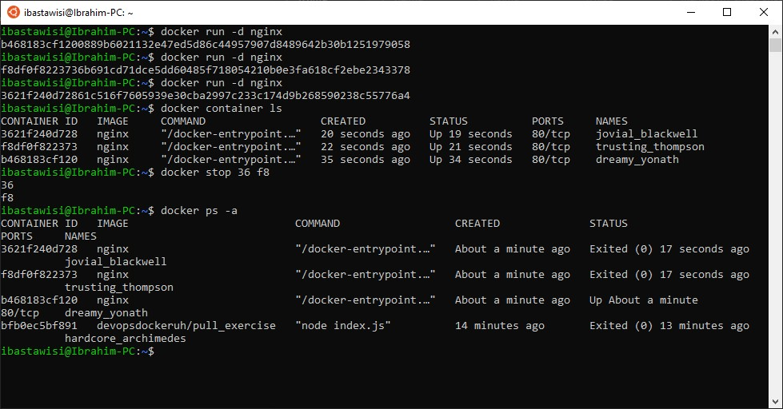

### 1.1 Getting started

Since we already did “Hello, World!” in the material let’s do something else.

Start 3 containers from image that does not automatically exit, such as nginx, detached.

Stop 2 of the containers leaving 1 up.

Submitting the output for docker ps -a is enough to prove this exercise has been done.

### Solution
```
docker run -d nginx
docker run -d nginx
docker run -d nginx
docker container ls
docker stop 36 f8
docker ps -a
```

