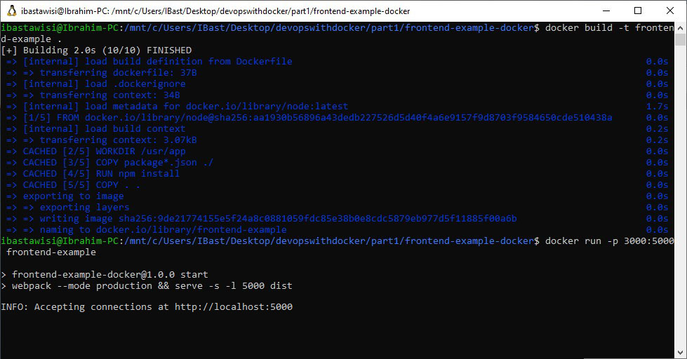

### 1.10
This exercise is mandatory

A good developer creates well written READMEs that can be used to create Dockerfiles with ease.

Clone, fork or download a project from https://github.com/docker-hy/frontend-example-docker.

Create a Dockerfile for the project and give a command so that the project runs in a docker container with port 5000 exposed and published so when you start the container and navigate to http://localhost:5000 you will see message if you’re successful.

Submit the Dockerfile.

As in other exercises, do not alter the code of the project

TIP: The project has install instructions in README.

TIP: Note that the app starts to accept connections when “Accepting connections at http://localhost:5000” has been printed to the screen, this takes a few seconds

TIP: You do not have to install anything new outside containers.

### Solution
```
docker build -t frontend-example .
docker run -p 3000:5000 frontend-example
```
> Exercise 1.10: Congratulations! You configured your ports correctly!

