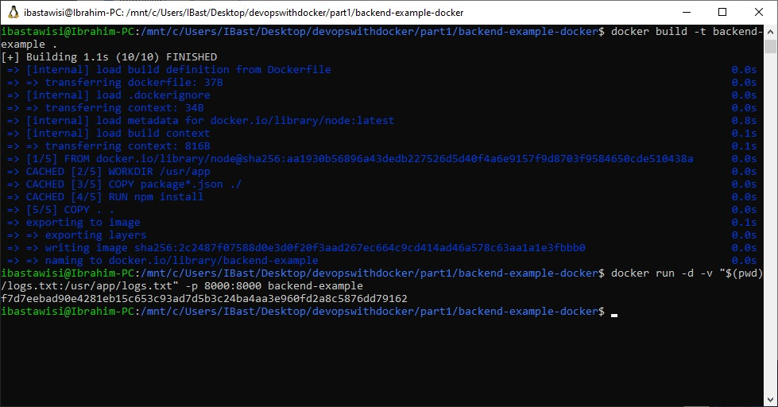

### 1.11
This exercise is mandatory

Clone, fork or download a project from https://github.com/docker-hy/backend-example-docker.

Create a Dockerfile for the project and give a command so that the project runs in a docker container with port 8000 exposed and published so when you start the container and navigate to http://localhost:8000 you will generate a message in logs.txt in the working directory.

Create a volume for the logs.txt so that when the application is shut down the logs are not destroyed. And when restarted it continues to write into the same logs.txt.

Submit the Dockerfile and the command used.

Do not alter the code of the project

### Solution
```
docker build -t backend-example .
docker run -d -v "$(pwd)/logs.txt:/usr/app/logs.txt" -p 8000:8000 backend-example
```
> Port configured correctly, generated message in logs.txt
1/5/2021, 2:23:16 AM: Connection received in root

