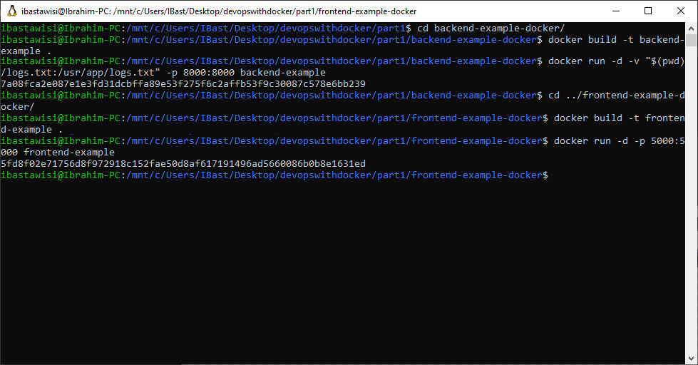

### 1.12
This exercise is mandatory

Start both frontend-example and backend-example with correct ports exposed and add ENV to Dockerfile with necessary information from both READMEs (front,back).

Ignore the backend configurations until frontend sends requests to _backend_url_/ping when you press the button.

You know that the configuration is ready when the button for 1.12 of frontend-example responds and turns green.

Do not alter the code of either project

Submit the edited Dockerfiles and commands used to run.

### Solution
```
docker run -d -p 8000:8000 backend-example
docker run -d -p 5000:5000 frontend-example
```
> Exercise 1.12: Working!

