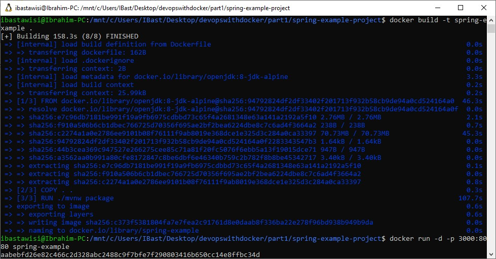

### 1.13
Lets create a Dockerfile for a Java Spring project: [github page](https://github.com/docker-hy/spring-example-project)

The setup should be straightforward with the README instructions. Tips to get you started:

Use [openjdk image](https://hub.docker.com/_/openjdk) FROM openjdk:_tag_ to get java instead of installing it manually. Pick the tag by using the README and dockerhub page.

You’ve completed the exercise when you see a ‘Success’ message in your browser.

### Solution
```
docker build -t spring-example .
docker run -d -p 3000:8080 spring-example
```
> Success

