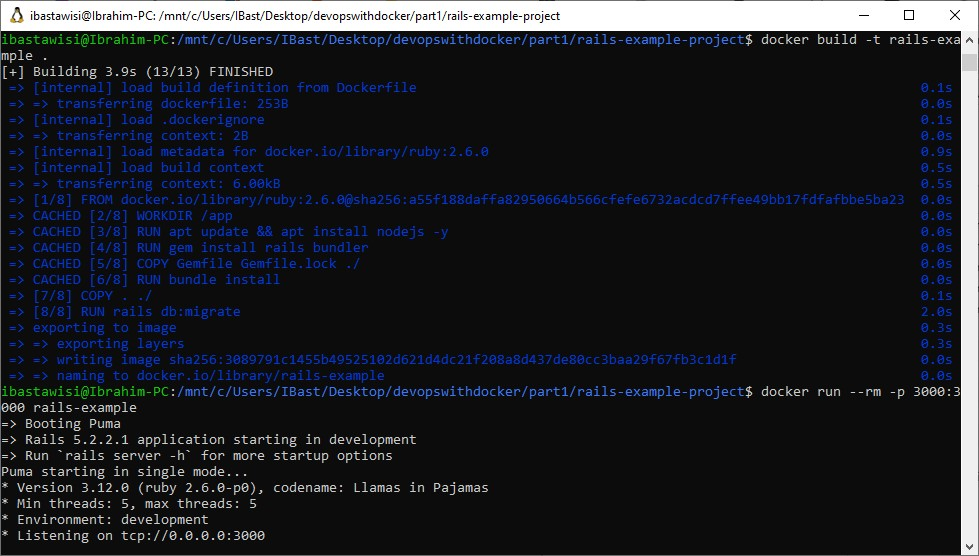

### 1.14
Lets create a Dockerfile for a rails project: [github page](https://github.com/docker-hy/rails-example-project).

Again we can take a look at the README for the project to see the installation instructions. Tips to get you started:

Use [Ruby image](https://hub.docker.com/_/ruby) FROM ruby:_tag_ to easily get most of what you’ll need at the beginning. Pick the tag by using the README and dockerhub page.

If you want you can make small edits to the program if you get stuck and google doesn’t help you configure the setup. If you did, explain the edits with your submission of the Dockerfile.

You’ve completed the exercise when the application works in your browser.

### Solution
```
docker build -t rails-example .
docker run --rm -p 3000:3000 rails-example
```
> Press was successfully created.

