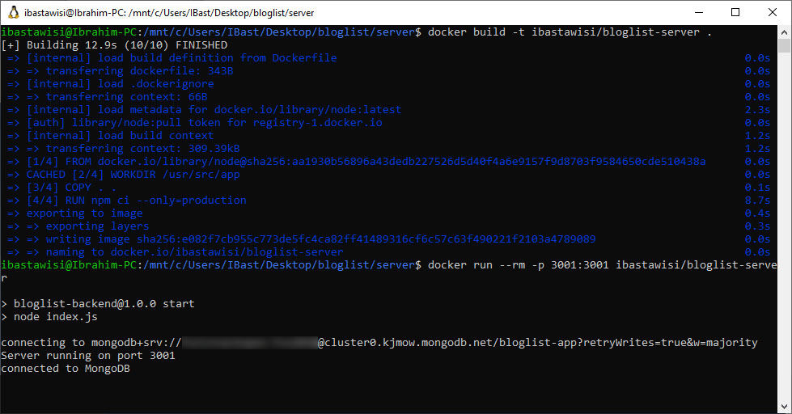

### 1.15
Create Dockerfile for an application or any other dockerised project in any of your own repositories and publish it to Docker Hub. This can be any project except clones / forks of backend-example or frontend-example.

For this exercise to be complete you have to provide the link to the project in docker hub, make sure you at least have a basic description and instructions for how to run the application in a README that’s available through your submission.

### Solution
```
docker build -t ibastawisi/bloglist-server .
docker run --rm -p 3001:3001 ibastawisi/bloglist-server
```
> https://hub.docker.com/r/ibastawisi/bloglist-server

