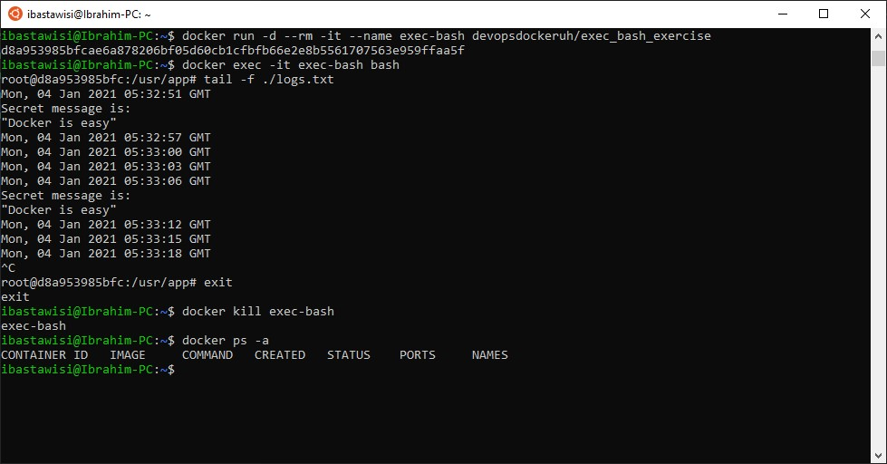

### 1.4
Now that we’ve warmed up it’s time to get inside a container while it’s running!

Start image devopsdockeruh/exec_bash_exercise, it will start a container with clock-like features and create a log. Go inside the container and use tail -f ./logs.txt to follow the logs. Every 15 seconds the clock will send you a “secret message”.

Submit the secret message and command(s) given as your answer.

### Solution
```
docker run -d --rm -it --name exec-bash devopsdockeruh/exec_bash_exercise
docker exec -it exec-bash bash
tail -f ./logs.txt
^C
exit
docker ps -a
```

> Secret message is:
"Docker is easy"

