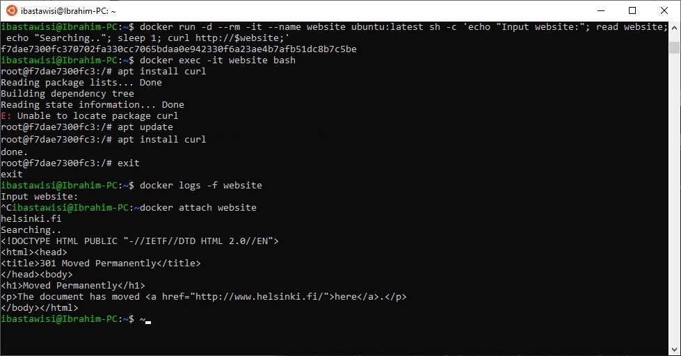

### 1.5
Start a ubuntu image with the process sh -c 'echo "Input website:"; read website; echo "Searching.."; sleep 1; curl http://$website;'

You will notice that a few things required for proper execution are missing. Be sure to remind yourself which flags to use so that the read actually waits for input.

Note also that curl is NOT installed in the container yet. You will have to install it from inside of the container.

Test inputting helsinki.fi into the application.

This time return the command you used to start process and the command(s) you used to fix the ensuing problems.

>This exercise has multiple solutions, if the curl for helsinki.fi works then it’s done. Can you figure out other (smart) solutions?

### Solution
```
docker run -d --rm -it --name website ubuntu:latest sh -c 'echo "Input website:"; read website; echo "Searching.."; sleep 1; curl http://$website;'
docker exec -it website bash
apt update
apt install curl
exit
docker attach website
helsinki.fi
```

