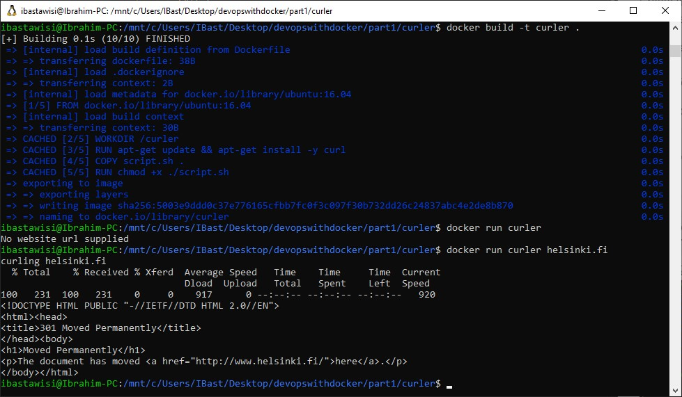

### 1.7
Now that we know how to create and build Dockerfiles we can improve previous works.

Create a Dockerfile for a new image that starts from ubuntu:16.04.

Make a script file on you local machine with such content as echo "Input website:"; read website; echo "Searching.."; sleep 1; curl http://$website;. Transfer this file to an image and run it inside the container using CMD. Build the image with tag “curler”.

Run command docker run [options] curler (with correct flags again, as in 1.5) and input helsinki.fi into it. Output should match the 1.5 one.

Return both Dockerfile(s) and the command you used to run the container(s)

### Solution
```
docker build -t curler .
docker run curler helsinki.fi
```

