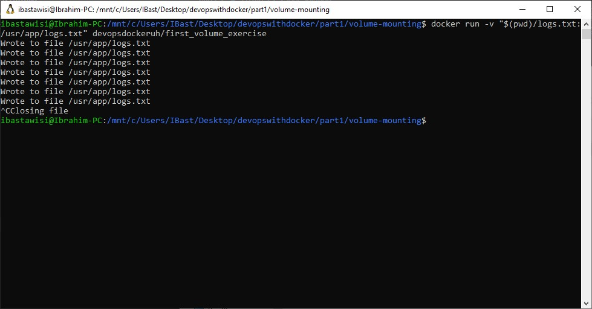

### 1.8
In this exercise we won’t create a new Dockerfile. Image devopsdockeruh/first_volume_exercise has instructions to create a log into /usr/app/logs.txt. Start the container with bind mount so that the logs are created into your filesystem.

Submit your used commands for this exercise.

### Solution
```
docker run -v "$(pwd)/logs.txt:/usr/app/logs.txt" devopsdockeruh/first_volume_exercise
```
> Secret message is:
"Volume bind mount is easy"

