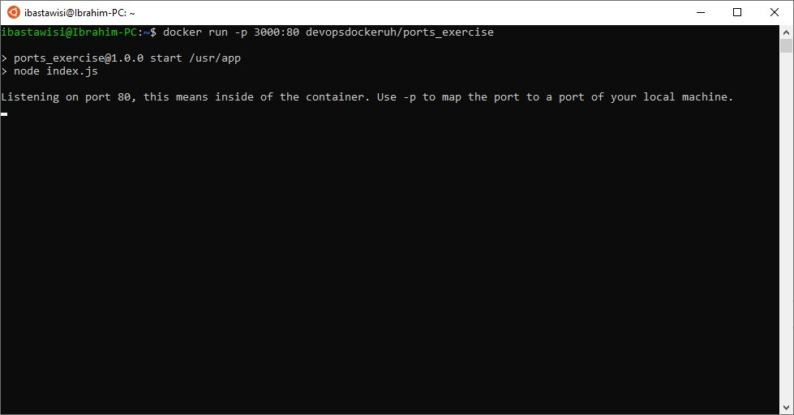

### 1.9
In this exercise we won’t create a new Dockerfile. Image devopsdockeruh/ports_exercise will start a web service in port 80. Use -p flag to access the contents with your browser.

Submit your used commands for this exercise.

### Solution
```
docker run -p 3000:80 devopsdockeruh/ports_exercise
```
> Ports configured correctly!!

