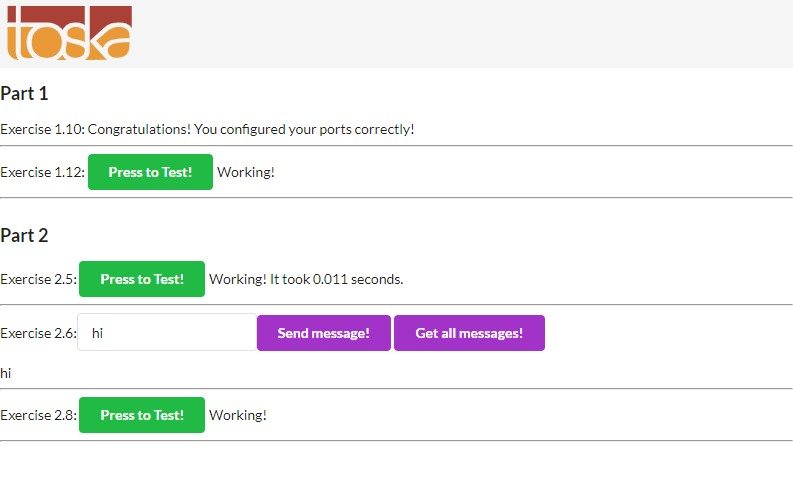

### 2.8
Add nginx to example frontend + backend.

Accessing your service from arbitrary port is counter intuitive since browsers use 80 (http) and 443 (https) by default. And having the service refer to two origins in a case where there’s only one backend isn’t desirable either. We will skip the SSL setup for https/443.

Nginx will function as a reverse proxy for us (see the image above). The requests arriving at anything other than /api will be redirected to frontend container and /api will get redirected to backend container.

At the end you should see that the frontend is accessible simply by going to http://localhost and the button works. Other buttons may have stopped working, do not worry about them.

As we will not start configuring reverse proxies on this course you can have a simple config file:

The following file should be set to /etc/nginx/nginx.conf inside the nginx container. You can use a file volume where the contents of the file are the following:
```
  events { worker_connections 1024; }

  http {
    server {
      listen 80;

      location / {
        proxy_pass _frontend-connection-url_;
      }

      location /api/ {
        proxy_pass _backend-connection-url_;
      }
    }
  }
```

Note that again inside the docker-compose network the connecting urls are usually form “http://hostname:port” where hostname and port are both known only inside the network.

Submit the docker-compose.yml

Nginx specific information on why the api might not be found with your url:
Without a trailing / in proxy_pass url nginx will preserve location in your url.
If you have / as the final symbol of the url nginx will omit the location.
So with location /api/ if you send a request to …/api/ping the request will be proxied to …/api/ping when proxy_pass ends in ; (no /). And to …/ping if it ends with /; The backend won’t answer from /api/ping but will answer from /ping.

### Solution
```
docker-compose up
```


